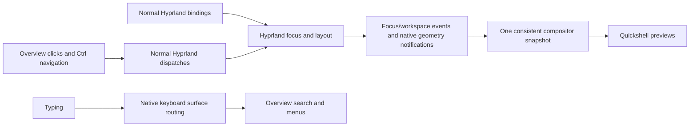

# Native control in Omaview

Investigation and implementation: 2026-09-19, Hyprland 0.56.2,
commit `efb50993780079460b0cbed1363e2166a2de1d9f`.

## What caused the mismatch

Omaview requested `WlrKeyboardFocus.Exclusive`. Hyprland's
[`CFocusState::rawWindowFocus`](https://github.com/hyprwm/Hyprland/blob/v0.56.2/src/desktop/state/FocusState.cpp)
returns before updating the active window while an exclusive layer is present.
This was a focus restriction, rather than just a missing notification.

The old overview worked around it with `selectedAddress`, geometric neighbor
prediction for two layouts, a separate `WorkspaceView.viewOffset`, and a delayed
focus dispatch after closing. Individual bindings reported their intended
actions through `externalFocus` / `externalChange`. Repeated layout commands
could consequently operate on a different window from the one highlighted in
the overview. Its three separate state queries could also observe different
moments, and its 600 ms geometry poll visibly lagged behind layout changes.

## Options considered

| Approach | What it enables | Tradeoff |
| --- | --- | --- |
| Shell with an exclusive layer | Search receives all typing | Real window focus is blocked; the original architecture cannot provide the requested behavior. |
| Shell with an on-demand or noninteractive layer | Ordinary dispatches can focus and arrange windows immediately | An on-demand layer loses keyboard focus to applications; a noninteractive layer cannot receive search typing. A separate launcher is viable. |
| Shell with a small native companion, implemented here | Native window focus and layout, search input, geometry notifications, existing grid and dock | Preview rendering still uses Quickshell and screencopy; the companion depends on the Hyprland ABI. |
| Full compositor overview renderer | Actual scaled compositor scene, native drag hit testing, gesture-driven zoom | Requires replacing the workspace view and integrating the launcher as a separate layer, plus maintaining compatibility with renderer internals. |

The distinctions between Exclusive, OnDemand and None are documented in
[Quickshell's keyboard focus API](https://quickshell.org/docs/v0.2.1/types/Quickshell.Wayland/WlrKeyboardFocus/).

[Niri's overview](https://niri-wm.github.io/niri/Overview.html) is a compositor
feature: its normal shortcuts continue working and pointer operations target
the scaled workspace scene. A shell surface cannot recreate all of that
through the layer-shell protocol alone.

[ScrollOverview](https://github.com/yayuuu/hyprland-scroll-overview) is the
closest native renderer candidate examined. The reviewed checkout was
`5e96ae20ec73c320248bcf3ff68b330bc1ed4152`. Its implementation hooks workspace
rendering, damage, frame delivery and pointer handling, and includes native
window dragging. Its advertised Hyprpm version pins in that checkout ended at
0.55.4; absence of a 0.56.2 pin does not prove incompatibility. It was inspected,
not installed or claimed to be tested on this machine. No native plugins were
loaded at the start of this investigation.

## Implemented architecture



Hyprland already distinguishes its active **window** from the **surface**
receiving keyboard input. The companion uses that distinction:

1. Omaview maps a nonexclusive, on-demand layer.
2. Ordinary Hyprland dispatches update the real active window and layout.
3. A native window-focus event restores keyboard input to the overview's layer
   without modifying the active window. A keyboard event listener also routes
   input before Hyprland evaluates its bindings. It does not cancel or decode
   keys, guess targets, wrap commands, or maintain an action history.
4. Focus and workspace events drive the shell observer. For geometry, which
   lacks a standard IPC event, a render listener compares actual layout goal
   coordinates at most once per 16 ms, only while the overview is mapped. It
   emits a notification only when those coordinates change. It neither forces
   frames nor starts a polling process.
5. `hyprctl omaview-state` invokes Hyprland's own JSON serializers in a single
   compositor turn. QML displays the reported focus and positions.
6. Closing unmaps the layer. Hyprland restores keyboard input to its current
   active window through its normal layer-unmap handling. Nothing is committed
   or replayed.

The timing of step 3 matters: restoring the keyboard surface only when the next
key arrives puts that key into Wayland's held-key list on focus entry. Testing
exposed a missed first character in Qt. Restoring during the native window-focus
notification fixes it before subsequent typing begins.

See the installed-version sources for
[input dispatch ordering](https://github.com/hyprwm/Hyprland/blob/v0.56.2/src/managers/input/InputManager.cpp),
[layer map/unmap behavior](https://github.com/hyprwm/Hyprland/blob/v0.56.2/src/desktop/view/LayerSurface.cpp),
and [the plugin API and ABI check](https://github.com/hyprwm/Hyprland/blob/v0.56.2/src/plugins/PluginAPI.hpp).

The QML change also preserves workspace delegates and dock items across
geometry-only updates and stops live captures when the panel is closed.

## Previews beyond the desktop viewport

Hyprland 0.56.2's
[`CScreenshareManager::onOutputCommit`](https://github.com/hyprwm/Hyprland/blob/v0.56.2/src/managers/screenshare/ScreenshareManager.cpp)
skips a window frame when its real geometry does not intersect its monitor.
A scrolling column can satisfy that condition while its scaled preview is
visible in Omaview. Its capture then stays empty until the desktop scrolls
closer to that column.

The companion listens for output commits and completes those pending frames
using Hyprland's existing `CScreenshareFrame::copy()`. It restricts this to
the mapped overview's Wayland client and monitor, checks window lifetime and
visibility, and stops during session lock. The normal capture implementation
still checks permissions, `no_screen_share`, buffers and copies in flight.
No window is focused or moved to obtain its preview.

The pending-frame queue and copy method are private SDK interfaces. The build
uses `-fno-access-control` to access them under the same strict ABI check as
the rest of the companion. It does not replace Hyprland functions. Monitor
listeners are removed on disconnect and plugin unload.

QML starts captures only for window rectangles intersecting the overview's
visible area, including the clipped peeks above and below. Fully clipped
previews release their capture source; closing releases all preview sources.

## Distribution

The repository contains the complete Omarchy plugin, including native source
and its build/load script. Installing
`https://github.com/turbineBMW/Omaview` with `omarchy plugin add` and `--enable`
uses the ordinary shell installer. Users configure their overview keybind; first
open compiles and loads the companion, using Omarchy's existing system packages.
There is no separate Hyprpm setup or installation of Hyprland configuration.

`Navigation.js` generates stateless Lua dispatchers bundled with the plugin.
They read the active window, layout and workspaces inside Hyprland when each
command executes. Focus uses the scrolling layout's focus command for tiled
scrolling windows and ordinary directional focus elsewhere. Workspace stepping
uses normal numbered workspaces on the current monitor and offers one trailing
empty workspace. No `require('hypr.layout_aware')` or
`require('hypr.dynamic_workspaces')` is needed, and no predicted state or queued
actions are kept in QML.

The supported, tested compositor is Hyprland 0.56.2. Standard Omarchy supplies
the compiler and package metadata through `base-devel`, plus `jq`, Hyprland
headers and dependency headers. A customized installation can be missing these;
the loader reports missing commands or development files. It does not install
system packages. A source update to the native companion takes effect on the
next Hyprland session; restarting only the shell retains the loaded native code.

## Boundaries

The authoritative focus, workspace and layout now belong to Hyprland. There
is still a read-only snapshot for drawing, and QML animates between the reported
layout goal coordinates. This is not a frame-perfect transform of Hyprland's
renderer: screencopy delivery and shell rendering add latency, and native
decorations are not part of every captured window texture.

Dragging arbitrary miniature window surfaces with transformed pointer
coordinates and interactive zoom gestures would need additional implementation
or a full native renderer. This change does not add those gestures. It fixes
the existing overview's control model while retaining apps, menus and the dock.

The companion uses Hyprland's internal C++ types. Builds are cached by ABI and
a complete identity of the source and trusted build inputs; the cached artifact
hash is verified before its retained file descriptor is loaded. The entry point
also validates the running ABI. Future Hyprland internal API changes can require
source adjustments. Failed builds or loads leave the overview closed with an
error notification instead of reviving the old simulated focus model.

## Validation

The integration test mounts an empty home at the normal home path inside
Bubblewrap and uses a separate session bus and compositor. The real Omarchy
shell installs and enables the plugin from a temporary Git repository through
`omarchy plugin add`. Opening through the configured keybind builds the native
companion from an empty cache. The test explicitly checks that the personal
Lua modules cannot be imported and no Hyprland config directory is installed.

It checks repeated native focus changes, immediate search input after focus,
ordinary compositor bindings, Ctrl navigation through QML, resize geometry,
workspace switching including a single trailing empty workspace, scrolling and
dwindle layouts, and unchanged active focus after closing. Reopening reuses the
compiled companion. A regression test creates six colored terminal windows,
including columns outside the desktop that are visible in the overview. It
checks frame availability and screenshot pixels before changing focus or
layout, and confirms fully clipped previews are not capturing. This test failed
against the previous native companion. It checks actual compositor addresses and coordinates
against the overview's observations. The system packages are those installed
on the host; this is not a fresh OS installation test.
`resolve_binds_by_sym` is enabled only in the temporary compositor because
`wtype` generates a virtual keymap with different keycodes from physical keys.

Run `python3 tests/integration.py` from this plugin directory. The test does not
modify your saved Hyprland configuration or dispatch mutations to your main
compositor. The overview can also be inspected with:

```bash
hyprctl -j plugin list
hyprctl omaview-state
omarchy-shell shell call turbinebmw.omaview status ''
```

The installed build also passed a live Omarchy-shell check: native focus changed
while Omaview remained open, its reported focused address matched Hyprland, and
closing preserved the active window. Hyprland configuration validation returned
no errors and the shell log contained no Omaview QML errors. The original plugin
and bindings were backed up before that change. The portability test also
backed up the entire Hyprland config directory and left its contents unchanged.
