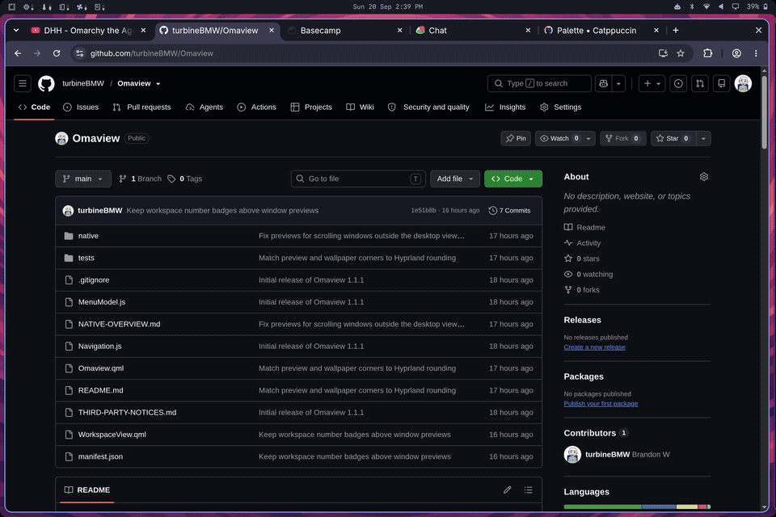
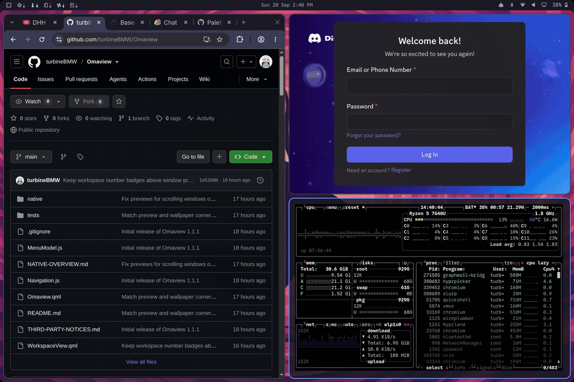
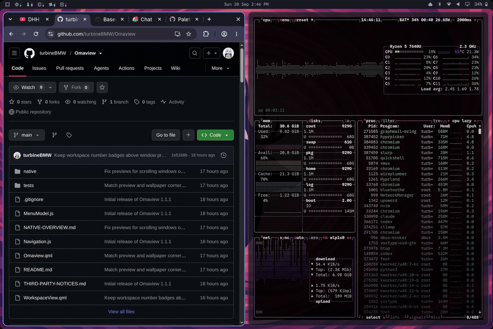
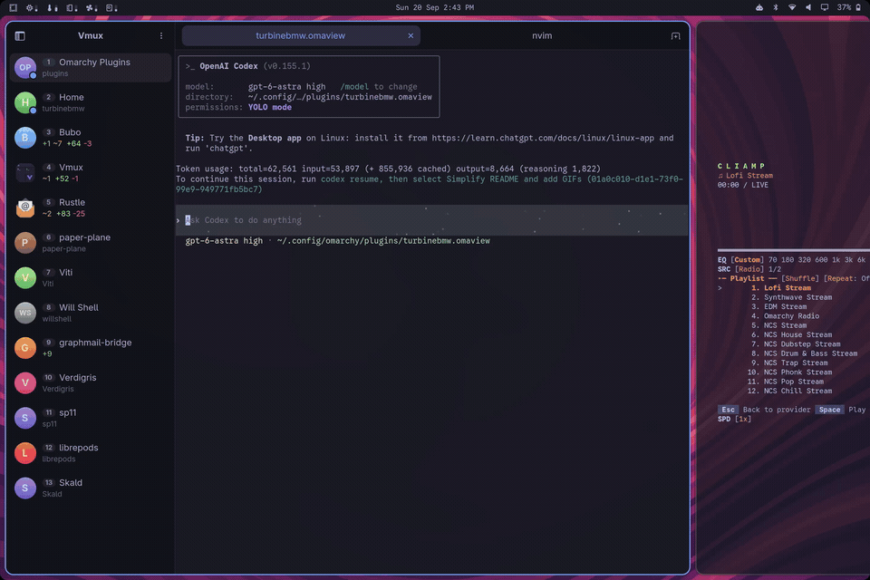

# Omaview

A fullscreen overview for Omarchy: live workspaces, an app launcher, Omarchy
menus, and a dock. Inspired by niri's overview and GNOME's app grid.



## Install

Requires Omarchy with Quickshell. Tested with **Hyprland 0.56.2**; other
versions haven't been validated.

```bash
omarchy plugin add https://github.com/turbineBMW/Omaview --enable
```

To open it with **Super+Space**, replace your existing binding in
`~/.config/hypr/bindings.lua`:

```lua
hl.unbind("SUPER + SPACE")
hl.bind("SUPER + SPACE", function()
  hl.exec_cmd("omarchy-shell shell toggle turbinebmw.omaview '{}'")
end)
```

Run `hyprctl reload`, then `hyprctl configerrors` to check the config.
You can also run the `omarchy-shell` command above directly.

The first open builds and loads a small native Hyprland companion. Standard
Omarchy includes the build dependencies; there's no separate Hyprpm setup.
After an update that changes the companion, restart your Hyprland session.

## Remove

Run `omarchy plugin remove turbinebmw.omaview`, then restart your Hyprland
session to unload the native companion. If you added the Super+Space binding
above, remove that binding and restore your previous one before reloading
Hyprland. The plugin does not modify Hyprland configuration during install.

Omarchy removes the plugin checkout. Your dock pins and hidden-app settings remain in
`~/.config/omarchy/omaview-pinned.json` and `omaview-hidden.json`
(or under `XDG_CONFIG_HOME`), and
compiled companions remain in `~/.cache/omaview/` (or under `XDG_CACHE_HOME`).
You may delete those files after the session restarts if you no longer need
them.

## Workspaces

With Hyprland's scrolling layout, the current workspace sits in the center,
with neighboring workspaces peeking in above and below. Other layouts get a
compact strip of workspace thumbnails.

- Click a window to focus it; double-click to jump into it. Middle-click closes it.
- Click a workspace to switch to it without leaving the overview.
- **Ctrl+Up/Down** switches workspaces. Moving past the last occupied one gives
  you an empty workspace.
- **Ctrl+Left/Right** moves focus between windows using the current layout.

Your usual Hyprland shortcuts still work, so you can move, resize, or rearrange
windows while the overview is open. Previews are live, including windows on
other workspaces.



## Apps, menus, and the dock

Type to search apps and Omarchy menu entries together. Use the arrow keys and
**Enter** to choose one. Your Omarchy menu extensions show up here too.
**Esc** clears the search, backs out of a menu, then closes the overview.



Right-click an app in the launcher to open a menu with **Pin to dock** (or
**Unpin from dock**) and **Hide app**. The **Hidden** tile at the end of the grid
opens your hidden apps; right-click one and choose **Unhide app** to restore it.
Hidden apps stay out of the main grid and normal search. Hiding an app leaves
its dock pin and running windows alone.

The dock holds pinned apps followed by anything else that's running.

- **Click** to launch an app or focus its windows; click again to cycle through them.
- **Middle-click** to open a new instance.
- **Right-click** to open a menu with **Pin to dock** or **Unpin from dock**.
- **Drag** pinned icons to reorder them. Press Esc or drop outside the pinned
  section to cancel.
- Hold **Ctrl** to show letter shortcuts, then press **Ctrl+A**, **Ctrl+B**, etc.
  to switch to that app and close the overview.

Pins are saved in `~/.config/omarchy/omaview-pinned.json`
(or under `XDG_CONFIG_HOME` if set). Hidden apps are saved alongside pins in
`omaview-hidden.json`. Context menus support arrow keys and Enter; Esc or a
click outside dismisses them.



## Options

Pass a JSON payload to the toggle command to choose a layout or open a submenu:

```bash
omarchy-shell shell toggle turbinebmw.omaview '{"layout":"strip"}'
omarchy-shell shell toggle turbinebmw.omaview '{"menu":"setup"}'
```

`layout` accepts `scrolling` or `strip`. Leave it out to follow the current
workspace's layout. `menu` accepts an Omarchy menu ID or alias.

See [Developing Omaview](DEVELOPING.md) for build requirements, integration
checks, and reload notes, or [Native overview](NATIVE-OVERVIEW.md) for the
architecture.

## Credits

Thanks to [rosakodu](https://github.com/rosakodu) for
[Omarchy Dock](https://github.com/rosakodu/omarchy-dock) and their work on a
native dock for Omarchy.

Omaview is released under the [MIT license](LICENSE). It also uses Omarchy's
menu model; see [Third-party notices](THIRD-PARTY-NOTICES.md) for acknowledgments
and the licenses of reused components.
